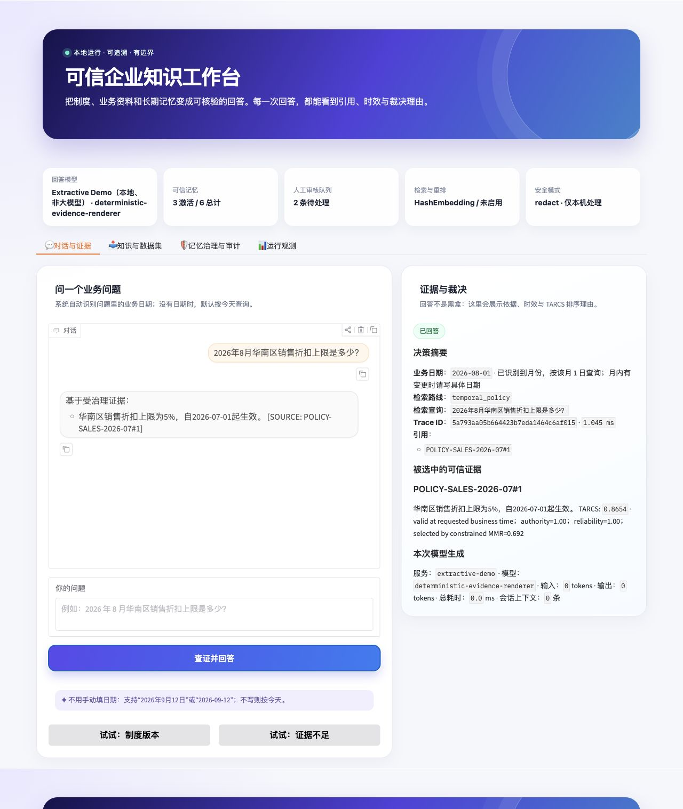

# TARCS-Mem

> The open-source trust layer for enterprise RAG and AI agents.

[](https://github.com/teresaliu90/TARCS-Mem/actions/workflows/ci.yml)

[](LICENSE)

[中文说明](README.zh-CN.md) · [Governance console](docs/CONSOLE.md) · [MCP & OpenAI integrations](docs/INTEGRATIONS.md) · [DeepSeek cloud setup (中文)](docs/DEEPSEEK_API_CN.md) · [Production deployment](docs/PRODUCTION_DEPLOYMENT.md) · [Community and enterprise direction](docs/COMMUNITY_AND_ENTERPRISE.md) · [Architecture](docs/ARCHITECTURE.md) · [Algorithm](docs/ALGORITHM.md)

TARCS-Mem answers a question that ordinary memory/RAG layers leave open: **which new facts may become active enterprise memory, and which evidence may be used to answer right now?**

It is deliberately not another general-purpose chatbot. It is a reusable governance layer for policy Q&A, ERP/operations assistants, and other enterprise agents where stale, low-authority, or unverified information is harmful.



| Ordinary RAG | TARCS-Mem |
| --- | --- |
| stores extracted text directly | admits, holds for review or rejects each memory |
| retrieves the closest chunks | filters tenant, role, status and business time before ranking |
| overwrites or ignores conflicting versions | preserves history and requires explainable supersession |
| asks the model to cite | blocks missing/invented citations and unauthorized cloud egress |

### Who is it for?

- Enterprise AI and platform engineers building governed RAG or Agent systems.
- Knowledge owners who need visible version, review and audit workflows.
- AI security and compliance teams evaluating evidence, access and cloud-egress controls.
- Integrators who want a provider-neutral governance layer instead of another chatbot builder.

## What is implemented in v0.8

- **GuardWrite** – admission policy for automatic memory writes; source provenance, evidence completeness, confidence and durable value decide `verified_active`, `pending`, or `rejected`.
- **Version and conflict governance** – append-only audit events; new authoritative records supersede older active records instead of overwriting them. Equal-authority conflicts remain pending for human review.
- **Bi-temporal memory** – separates business `valid_time` from system `observed_at`.
- **GuardRead / TARCS** – hybrid lexical + semantic-style retrieval, RRF fusion, hard validity/status constraints, then Time–Authority–Reliability–Cost scoring and token-budgeted MMR context selection.
- **Evidence-aware abstention** – returns a structured abstention when evidence is unavailable or unresolved conflicts remain.
- **Human review loop** – named reviewers can approve or reject pending memories with notes; low-authority evidence cannot silently override an active policy.
- **Enterprise security baseline** – credential blocking, PII redaction, tenant boundaries, document role ACLs, classification labels and optional bearer authentication.
- **Privacy-safe observability** – Prometheus metrics, bounded in-memory spans, trace IDs and P95 latency without raw query/document capture.
- **Reproducible evaluation** – synthetic governance cases plus a real labelled FiQA test/qrels candidate-pool benchmark.
- **Local or cloud generation** – switch between local Ollama/Qwen3 and the DeepSeek cloud API without changing the governance path.
- **Cloud egress enforcement** – DeepSeek (or another cloud adapter) receives evidence only after a classification allow-list check; `confidential` and `restricted` are blocked by default, with privacy-safe audit events and metrics.
- **Citation verification** – a generated answer must cite an exact source label from the governed evidence pack; missing or invented citations are blocked before return.
- **MCP v2 integration** – any MCP host can search governed memory; agent-authored proposals are forced into low-authority human review and cannot self-promote to policy.
- **OpenAI-compatible gateway** – existing chat clients can use `/v1/chat/completions` while TARCS citation, time, access and egress controls remain enforced.
- **LangChain and LlamaIndex adapters** – convert governed evidence into each framework's native retriever with one function call; neither adapter can read the unfiltered candidate pool.
- **Incremental Confluence connector** – Confluence Cloud REST API v2 cursor pagination, version/hash checkpoints, deterministic retry-safe IDs, safe deletion handling and human-review defaults.
- **Beginner-friendly governance console** – one FastAPI-served React workspace for health, safe query experiments, governed memories, named human review, privacy-safe traces and integrations.
- **Production-oriented delivery** – retry-safe write idempotency, rate limits, liveness/readiness endpoints, request IDs, non-root Docker runtime, audit log, 92 tests, Python 3.11/3.12 and Node CI, clean-wheel/extras/Docker checks, dependency automation and explicit security/deployment guidance.

`TARCS-Mem` is a reference implementation, not a claim of production certification. Request-body roles are demo inputs, not trusted identity claims. A real production deployment must bind tenant/roles from OIDC/SSO, externalize authorization policy, add encryption/key management, malware scanning, retention controls, SIEM export, backup/restore and load/red-team tests.

## Architecture

```text
Documents / conversations / approval records
                  |
            GuardWrite
 extract -> schema validate -> admission -> conflict resolver
                  |
  append-only audit events + active memory projection
                  |
User question -> hybrid retrieval -> RRF -> TARCS constraints/ranking
                  |                         |
                  |                    token-budget MMR
                  v                         v
              evidence pack -> verification -> answer / clarify / abstain
```

Read the formal choices in [docs/ALGORITHM.md](docs/ALGORITHM.md) and the component boundaries in [docs/ARCHITECTURE.md](docs/ARCHITECTURE.md).

## Try it in five minutes

Requires Python 3.11+.

```bash
git clone https://github.com/teresaliu90/TARCS-Mem.git
cd TARCS-Mem
python -m venv .venv
source .venv/bin/activate
pip install -e '.[api]'
tarcsmem seed --db ./data/tarcsmem-demo.db --if-empty
tarcsmem serve --db ./data/tarcsmem-demo.db --port 8000
```

Open `http://127.0.0.1:8000/console/` and run the **Policy version** scenario.
The first experience uses six synthetic records and needs no model API key, model download
or vector database.

You can also inspect the same governed answer from the command line:

```bash
tarcsmem ask --db ./data/tarcsmem-demo.db \
  --question '2026年8月华南区销售折扣上限是多少？' \
  --as-of 2026-08-15
```

The v0.8 console uses the same API and needs no separate frontend process. If `TARCSMEM_API_KEY`
is enabled, enter the token in **Integration center → Configure API Key**; it is kept
only in the current browser tab. See [the console guide](docs/CONSOLE.md).

### Minimal Python example

```python
from datetime import date

from tarcsmem import TARCSMemoryService
from tarcsmem.models import MemoryRecord, SourceType

memory = TARCSMemoryService(":memory:")
try:
    memory.ingest(
        MemoryRecord(
            fact="Expense claims above $5,000 require finance approval.",
            source_type=SourceType.OFFICIAL_POLICY,
            source_ref="FIN-POLICY-2026#12",
            authority=1.0,
            conflict_key="expense-approval-limit",
            valid_from=date(2026, 1, 1),
            evidence=["FIN-POLICY-2026#12"],
        )
    )
    result = memory.query("When is finance approval required?", date(2026, 8, 1))
    print(result.outcome, result.answer, result.citations)
finally:
    memory.close()
```

Or run the API in a container:

```bash
docker compose up --build
```

For generated, cited answers through the service API, install the agent/provider extras and call `POST /v1/chat`; it follows the same TARCS retrieval and policy gates as the UI:

```bash
pip install -e '.[api,agent,cloud]'
curl -X POST http://localhost:8000/v1/chat \
  -H 'content-type: application/json' \
  -d '{"question":"2026年8月华南区销售折扣上限是多少？","as_of":"2026-08-15","tenant_id":"default","roles":[]}'
```

The API accepts tenant and role fields only as local-demo inputs. Put it behind OIDC/SSO and inject verified claims before production. The full pilot-to-production checklist is in [docs/PRODUCTION_DEPLOYMENT.md](docs/PRODUCTION_DEPLOYMENT.md).

## Ecosystem and integrations

| Integration | Status | Governance boundary |
| --- | --- | --- |
| MCP v2 / Claude-compatible MCP hosts | Ready | Agent proposals cannot self-promote |
| OpenAI-compatible clients | Ready | Non-streaming so citation verification can fail closed |
| DeepSeek | Ready | `confidential` and `restricted` evidence is blocked by default |
| LangChain / LlamaIndex | Ready | Native retrievers receive governed evidence only |
| Qdrant | Ready | Vector candidates remain subject to hard policy filters |
| Confluence Cloud | Ready | Incremental imports default to human review |
| Notion / SharePoint / pgvector | Roadmap | Community contributors wanted |

Claude and other compatible hosts connect through MCP; TARCS-Mem does not currently claim a
native Anthropic generation adapter. See [the integration guide](docs/INTEGRATIONS.md) for
copy-paste configuration and explicit security boundaries.

### Connect existing agent and chat tools

Run TARCS-Mem as an MCP v2 stdio server:

```bash
pip install -e '.[mcp]'
tarcsmem-mcp
```

Or point an OpenAI-compatible client at `http://127.0.0.1:8000/v1` and use model
`tarcsmem-governed`. The compatibility endpoint is deliberately non-streaming
so citation verification can fail closed before response bytes are released.
See [the integration guide](docs/INTEGRATIONS.md) for host configuration, curl
examples and security boundaries.

Use TARCS-Mem as a native retriever in an existing framework:

```python
from datetime import date
from tarcsmem import TARCSMemoryService, as_langchain_retriever, as_llamaindex_retriever

memory = TARCSMemoryService("./data/tarcsmem.db")
langchain_retriever = as_langchain_retriever(memory, date.today())
llamaindex_retriever = as_llamaindex_retriever(memory, date.today())
```

Install with `pip install -e '.[integrations]'`. Both adapters return only evidence
that passed tenant/role, status, business-time and conflict gates.

Incrementally sync a real Confluence Cloud space into the same governance path:

```bash
export TARCSMEM_CONFLUENCE_BASE_URL=https://your-site.atlassian.net
export TARCSMEM_CONFLUENCE_EMAIL=you@example.com
export TARCSMEM_CONFLUENCE_SPACE_ID=123456
export TARCSMEM_CONFLUENCE_API_TOKEN='read-from-your-secret-manager'
tarcsmem sync-confluence --db ./data/tarcsmem.db
```

The default source type is `meeting_note`, so imported pages wait for review. Only
use `--source-type official_policy --authority 1.0` for a space whose publication
workflow is itself an approved policy control. See [the connector guide](docs/INTEGRATIONS.md#confluence-cloud-incremental-sync).

### Five-minute local UI preview

The default first-run profile uses dependency-light Hash retrieval and a deterministic evidence renderer. It needs no API key, Ollama process or model download:

```bash
python -m venv .venv
source .venv/bin/activate
pip install -e '.[ui,dev]'
tarcsmem ui --db ./data/tarcsmem-demo.db
```

Open `http://127.0.0.1:7860`. This preview still runs GuardWrite, conflict governance,
TARCS filtering/ranking, abstention, citation verification and audit logging. The renderer is not
an LLM and does no reasoning; it exposes selected evidence with exact citations so the complete
governance path is reproducible. Follow [docs/LOCAL_AGENT.md](docs/LOCAL_AGENT.md) to explicitly
enable Qwen3, BGE embeddings/reranking and the complete local RAG path.

### DeepSeek cloud generation (no local LLM)

Revoke any key that has appeared in chat, screenshots or logs. Put a newly generated key only in
an untracked `.env` file, then load it into the current shell:

```bash
pip install -e '.[ui,dev,api,cloud]'
cp .env.example .env
# Edit .env: TARCSMEM_LLM_PROVIDER=deepseek and DEEPSEEK_API_KEY=<new key>
set -a
source .env
set +a
export TARCSMEM_EMBEDDING_BACKEND=hash
export TARCSMEM_RERANKER=off
tarcsmem ui --db ./data/tarcsmem-deepseek.db
```

The default cloud model is `deepseek-v4-flash` in non-thinking mode. Selected evidence and the
question leave the machine in cloud mode, so use only data authorized for that provider. The
enforced default permits only `public,internal` classifications; confidential/restricted evidence
blocks cloud generation until a security owner changes `TARCSMEM_CLOUD_ALLOWED_CLASSIFICATIONS`.
See
[the DeepSeek setup and security guide](docs/DEEPSEEK_API_CN.md).

## Full local conversational Agent

The project also contains a complete local Agent path: Ollama/Qwen3 for dialogue, BGE-M3 embeddings, BGE reranking, Qdrant vector search, document upload, cited answers, a public SEC EDGAR connector, and a Gradio interface. Follow [docs/LOCAL_AGENT.md](docs/LOCAL_AGENT.md). It runs without a paid model API, but needs local model downloads and suitable hardware.

## Use cases

- **Enterprise policy assistants** — prevent superseded policies, meeting notes or unauthorized documents from silently becoming the answer.
- **Financial and quantitative research governance** — retain source provenance, observation time, classification and supersession history. TARCS-Mem does not provide investment advice; dataset licenses still apply.
- **Research knowledge bases** — separate hypotheses, observations and approved findings, and abstain while evidence remains unresolved.

## Example result

```json
{
  "outcome": "answered",
  "answer": "Based on 1 governed evidence record(s): 华南区销售折扣上限为5%，自2026-07-01起生效。",
  "citations": ["POLICY-SALES-2026-07#1"],
  "decision_trace": {
    "as_of": "2026-08-15",
    "selected": [{"id": "sales-v2", "tarcs_score": 0.91}],
    "excluded": [{"id": "sales-meeting-note", "reason": "pending memory is not eligible"}]
  }
}
```

The answer renderer is intentionally deterministic. In a real LLM application, send only `selected_evidence` to the model and require structured citations; retain the same verification and abstention gates.

## Core record schema

Each memory carries provenance and governance metadata:

```json
{
  "id": "sales-v2",
  "fact": "华南区销售折扣上限为5%，自2026-07-01起生效。",
  "source_type": "official_policy",
  "authority": 1.0,
  "source_ref": "POLICY-SALES-2026-07#1",
  "valid_from": "2026-07-01",
  "valid_to": null,
  "observed_at": "2026-06-20T09:00:00+00:00",
  "conflict_key": "sales_discount_limit:华南区",
  "status": "verified_active"
}
```

## Community Edition and future enterprise services

The MIT-licensed Community Edition is intentionally complete enough to evaluate and run a
useful local governance path. It includes the governance core, v0.8 console, Docker/SQLite
deployment, MCP and OpenAI-compatible integrations, basic observability and synthetic evaluation.

| Community Edition | Future enterprise or paid service |
| --- | --- |
| GuardWrite/GuardRead, time/version/conflict rules, abstention and citation verification | Hosted control plane, managed upgrades, SLA and support |
| Local identity inputs, ACL/classification baseline and cloud-egress gate | OIDC/SSO, SCIM, verified claims, enterprise RBAC and policy administration |
| SQLite/Docker, Qdrant, Confluence and framework adapters | PostgreSQL/HA, multi-tenant operations, SIEM/OTLP, retention/legal hold and compliance reports |
| Public issues, docs and synthetic fixtures | Organization-specific connectors, private deployment, training and design-partner evaluation |

Paid capabilities are a planned boundary, not a claim that they already exist. The project will
not put core governance semantics behind a paywall; hosted operations, private integrations and
deployment expertise are the intended commercial surface. See [Community and enterprise direction](docs/COMMUNITY_AND_ENTERPRISE.md).

## Evaluation

The benchmark compares naive lexical retrieval with TARCS-Mem on controlled difficult cases. It reports:

- answer correctness;
- freshness / authoritative-source selection;
- correct abstention;
- average selected evidence and estimated context tokens.

The checked-in real-data report now uses **120 FiQA test queries and 610 candidate documents**. It compares lexical, hashed semantic, RRF, and complete TARCS ablations with 1,000-sample bootstrap confidence intervals. TARCS reaches Recall@10 **0.4446**, MRR@10 **0.4839**, and NDCG@10 **0.3783**, versus **0.3624**, **0.3748**, and **0.2988** for the lexical baseline. The report also exposes the latency trade-off. It remains a qrel-plus-distractor bounded pool, not a full-corpus BEIR leaderboard result. See [docs/EVALUATION.md](docs/EVALUATION.md) and the machine-readable [report](docs/benchmarks/fiqa-public-report.json).

Core regression tests additionally cover zero-overlap RRF pollution, relevance filtering before token budgeting, true greedy document-only MMR, and candidate oversampling before ACL/status/time filtering. These tests do not retroactively claim a higher FiQA score.

A verified legacy v0.7 Chinese walkthrough and timed narration script remain available under [docs/demo](docs/demo/); the current product surface is the v0.8 governance console.

For a portfolio-quality evaluation, combine the repository's synthetic governance scenarios with LongMemEval (memory), FinQA (financial document/table reasoning), and optionally BIRD Mini-Dev (Text-to-SQL). The exact source links, intended use and non-redistribution rule are in [docs/DATASET.md](docs/DATASET.md).

## Repository layout

```text
src/tarcsmem/       core package
console/            React/TypeScript console source
tests/              unit and workflow tests
docs/               architecture, algorithm, data and security notes
examples/           copy-paste MCP and OpenAI-compatible integrations
.github/workflows/  CI
Dockerfile          local API image
```

## Contributing

You do not need to understand the complete TARCS algorithm before contributing. We welcome:

- documentation, examples, translations and accessibility improvements;
- React console and UI polish;
- data-source connectors and synthetic test fixtures;
- TypeScript/Go SDK work, deployment templates and evaluation tools.

Start with [`good first issue`](https://github.com/teresaliu90/TARCS-Mem/labels/good%20first%20issue)
or [`help wanted`](https://github.com/teresaliu90/TARCS-Mem/labels/help%20wanted), then read
[`CONTRIBUTING.md`](CONTRIBUTING.md). Changes to admission, ACL, conflict, citation or cloud-egress
semantics require an explicit threat model and adversarial tests.

## Roadmap

The next six months focus on faster onboarding, connector contracts, TypeScript SDK support,
design-partner evidence and production-readiness verification. See [`ROADMAP.md`](ROADMAP.md).

## License

MIT. Do not include customer documents, API keys, internal business rules, or personally identifiable data in a public repository.
