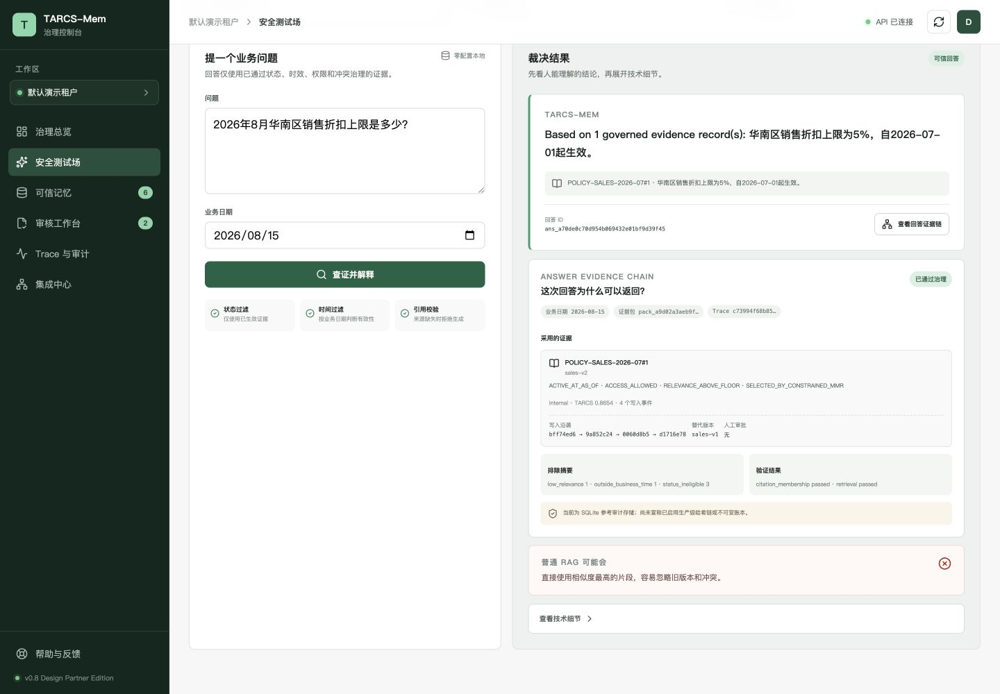

# TARCS-Mem

> 面向企业 RAG 与 AI Agent 的开源可信记忆治理层。

[](https://github.com/teresaliu90/TARCS-Mem/actions/workflows/ci.yml)

[](LICENSE)

[English README](README.md) · [治理控制台](docs/CONSOLE.md) · [MCP 与 OpenAI 接入](docs/INTEGRATIONS.md) · [DeepSeek 云端配置](docs/DEEPSEEK_API_CN.md) · [生产部署手册](docs/PRODUCTION_DEPLOYMENT.md) · [社区版与企业服务边界](docs/COMMUNITY_AND_ENTERPRISE_CN.md) · [架构说明](docs/ARCHITECTURE.md) · [治理流水线设计](docs/GOVERNANCE_PIPELINE_DESIGN.md) · [下一阶段升级方案](docs/NEXT_STAGE_UPGRADE_PLAN.md) · [安全设计](docs/SECURITY.md) · [可观测性](docs/OBSERVABILITY.md) · [真实评测](docs/EVALUATION.md)

## 项目状态

**Early Alpha / 企业 AI 治理参考实现。** 当前版本适合本地评估、合成数据演示和边界明确的
Design Partner 试点，并非已认证的企业生产安全产品。仓库已提供经过测试的端到端本地治理
路径；可信身份、高可用存储和企业审计运维仍属于部署责任或路线图工作。详见
[路线图](ROADMAP.md)、[下一阶段升级方案](docs/NEXT_STAGE_UPGRADE_PLAN.md)和
[社区版与企业服务边界](docs/COMMUNITY_AND_ENTERPRISE_CN.md)。愿意参加 30 分钟合成数据评审的
工程师可直接使用[企业工程师反馈与匿名试点执行包](docs/DESIGN_PARTNER_FEEDBACK_KIT_CN.md)。

## 项目解决什么问题

普通 RAG 通常只回答“哪些文本与问题最相关”，但企业知识应用还必须回答：

- 一条聊天内容、会议纪要或模型推断，是否有资格写入长期记忆？
- 新旧制度冲突时，哪个版本在指定业务日期有效？
- 证据权威性不足或相互冲突时，系统能否拒答并留下审计记录？

TARCS-Mem 在知识写入、检索和生成之间增加可解释的治理层：

- **GuardWrite**：按来源、证据完整性、抽取置信度和长期价值决定激活、待审核或拒绝；
- **双时间与冲突治理**：同时记录业务生效时间与系统获知时间，保留被替代版本；
- **GuardRead / TARCS**：融合相关性、时效、权威、可靠性与上下文成本，再进行预算内 MMR 证据选择；
- **可信拒答**：没有合格证据时明确拒答，不把模型推断当事实；
- **人工审核闭环**：具名审核人可批准或驳回待审核记忆，备注和状态变化进入审计轨迹；低权威来源不能静默覆盖现行制度。
- **企业安全基线**：写入前凭证阻断、PII 脱敏、租户隔离、文档角色 ACL、数据分级和可选 Bearer 鉴权；查询审计不保存原始问题。
- **云端出境拦截**：云端模型调用前按已选证据分类强制校验，默认只允许 `public/internal`；机密与受限内容会拒绝出境，并留下不含正文的审计事件和指标。
- **生成引用校验**：模型输出必须引用受治理证据包里的准确 `[SOURCE: ...]` 标签；缺失或编造来源的回答会被拦截。
- **回答级审计 API**：每次查询都会生成稳定的回答、证据包和关联 ID；`GET /v1/answers/{answer_id}/audit` 在重新校验租户与 ACL 后，返回不含问题和证据正文的证据沿袭、排除摘要、策略引用与验证结果。
- **隐私安全的可观测性**：内置 Prometheus 文本指标、有限内存链路追踪、trace ID 和 P95 延迟统计，默认不采集问题、文档或密钥正文。
- **MCP v2 接入**：任意 MCP Host 可以检索可信记忆；Agent 提交的记忆被固定为低权威待审核声明，无法冒充正式制度自动激活。
- **OpenAI 兼容网关**：现有聊天客户端可以调用 `/v1/chat/completions`，同时保留时间、权限、引用和云端出境治理。
- **LangChain / LlamaIndex 一行式适配**：直接返回两个框架的原生 Retriever，且只能看到通过 GuardRead 的证据。
- **Confluence 真实增量同步**：基于 Confluence Cloud REST API v2，支持游标分页、版本与内容哈希检查点、确定性幂等 ID、安全删除确认和默认人工审核。
- **新手友好的治理控制台**：通过三步引导完成演示数据确认、治理问答和回答证据链查看，也可继续使用可信记忆、具名人工审核、隐私安全 Trace 和集成配置。



| 普通 RAG | TARCS-Mem |
| --- | --- |
| 抽取后直接写入文本 | 每条记忆进入激活、待审核或拒绝状态 |
| 只取最相似片段 | 排序前强制校验租户、角色、状态和业务时间 |
| 覆盖旧版本或忽略冲突 | 保留历史并解释新版本为何替代旧版本 |
| 仅提示模型添加引用 | 拦截缺失/编造引用和未授权云端出境 |

### 适合谁

- 正在建设企业 RAG、Agent 或知识库平台的 AI 工程师；
- 需要管理制度版本、人工审核和审计记录的知识负责人；
- 关注权限、数据分级、引用和云端出境的安全/合规团队；
- 希望在现有技术栈前增加治理层，而不是更换为另一套聊天机器人的集成商。

## 技术栈

Python · FastAPI · Qwen3 / Ollama · BGE · Qdrant · SQLite · Gradio · Docker · Pytest

核心治理算法不依赖模型或向量数据库；Qwen3、BGE 与 Qdrant 是可替换的本地适配器。

## 5 分钟运行治理控制台

需要 Python 3.11+：

```bash
git clone https://github.com/teresaliu90/TARCS-Mem.git
cd TARCS-Mem
python -m venv .venv
source .venv/bin/activate
pip install -e '.[dev,api]'

tarcsmem seed --db ./data/tarcsmem-demo.db --if-empty
tarcsmem serve --db ./data/tarcsmem-demo.db --port 8000
```

浏览器打开 `http://127.0.0.1:8000/console/`。控制台与 FastAPI 使用同一服务，不需要单独运行前端。按首页的三步引导操作：

1. 确认已经加载 6 条合成记录；
2. 进入“安全测试场”，运行“制度版本”场景；
3. 点击“查看回答证据链”，查看回答 ID、采用/排除证据、策略引用、验证结果和写入沿袭。

整个过程不需要模型 API Key、模型下载或向量数据库。页面明确显示 SQLite 参考存储尚不具备不可篡改证明。启用 `TARCSMEM_API_KEY` 后，在“集成中心 → 配置 API Key”填写令牌；令牌只保存在当前浏览器标签页。详细说明见 [治理控制台指南](docs/CONSOLE.md)。

### 最小 Python 示例

```python
from datetime import date

from tarcsmem import TARCSMemoryService
from tarcsmem.models import MemoryRecord, SourceType

memory = TARCSMemoryService(":memory:")
try:
    memory.ingest(
        MemoryRecord(
            fact="超过 5 万元的费用报销必须经过财务审批。",
            source_type=SourceType.OFFICIAL_POLICY,
            source_ref="FIN-POLICY-2026#12",
            authority=1.0,
            conflict_key="expense-approval-limit",
            valid_from=date(2026, 1, 1),
            evidence=["FIN-POLICY-2026#12"],
        )
    )
    result = memory.query("什么情况下需要财务审批？", date(2026, 8, 1))
    print(result.outcome, result.answer, result.citations)
finally:
    memory.close()
```

原有 Gradio 对话演示仍可通过 `pip install -e '.[ui,dev]'` 和 `tarcsmem ui --db ./data/tarcsmem-demo.db` 启动，默认地址为 `http://127.0.0.1:7860`。它适合体验文档上传与本地/云端 Agent；v0.8 控制台更适合治理人员和试点演示。

## 生态与集成

| 集成 | 状态 | 治理边界 |
| --- | --- | --- |
| MCP v2 / Claude-compatible MCP Host | 可用 | Agent 提议不能自行晋升为正式制度 |
| OpenAI-compatible 客户端 | 可用 | 非流式返回，完整答案先通过引用校验 |
| DeepSeek | 可用 | 默认禁止机密和受限证据出境 |
| LangChain / LlamaIndex | 可用 | 原生 Retriever 只接收合格证据 |
| Qdrant | 可用 | 向量候选仍经过权限、状态和时间过滤 |
| Confluence Cloud | 可用 | 增量导入默认进入人工审核 |
| Notion / SharePoint / pgvector | 路线图 | 欢迎社区贡献 |

Claude 等兼容 Host 通过 MCP 接入；当前项目不宣称已经实现原生 Anthropic 生成适配器。

### 接入已有 Agent 与聊天工具

作为 MCP v2 stdio 服务运行：

```bash
pip install -e '.[mcp]'
tarcsmem-mcp
```

也可以把 OpenAI 兼容客户端的 `base_url` 指向
`http://127.0.0.1:8000/v1`，模型填写 `tarcsmem-governed`。当前接口刻意不提供流式输出，确保完整答案先通过引用校验再返回。Host 配置、curl 示例和安全边界见 [集成指南](docs/INTEGRATIONS.md)。

已有 LangChain 或 LlamaIndex 项目可直接接入：

```python
from datetime import date
from tarcsmem import TARCSMemoryService, as_langchain_retriever, as_llamaindex_retriever

memory = TARCSMemoryService("./data/tarcsmem.db")
langchain_retriever = as_langchain_retriever(memory, date.today())
llamaindex_retriever = as_llamaindex_retriever(memory, date.today())
```

安装 `pip install -e '.[integrations]'`。两个适配器都不会把未通过权限、状态、业务时间和冲突治理的候选片段交给上层框架。

使用真实 Confluence Cloud 空间做增量同步：

```bash
export TARCSMEM_CONFLUENCE_BASE_URL=https://your-site.atlassian.net
export TARCSMEM_CONFLUENCE_EMAIL=you@example.com
export TARCSMEM_CONFLUENCE_SPACE_ID=123456
export TARCSMEM_CONFLUENCE_API_TOKEN='从密钥管理器读取'
tarcsmem sync-confluence --db ./data/tarcsmem.db
```

默认按 `meeting_note` 低权威来源导入并进入人工审核。只有当该空间本身已有正式发布审批流程时，才使用 `--source-type official_policy --authority 1.0`。完整边界见 [Confluence 增量同步说明](docs/INTEGRATIONS.md#confluence-cloud-incremental-sync)。

## 不运行本地大模型：使用 DeepSeek API

先撤销任何曾发送到聊天、截图或日志中的密钥，并在 DeepSeek 控制台生成新密钥。密钥只能保存在本机环境变量或被 `.gitignore` 排除的 `.env` 中：

```bash
pip install -e '.[ui,dev,api,cloud]'
cp .env.example .env
# 在 .env 中把 TARCSMEM_LLM_PROVIDER 改为 deepseek，并填写新密钥：
# DEEPSEEK_API_KEY=你的新密钥

set -a
source .env
set +a

export TARCSMEM_EMBEDDING_BACKEND=hash
export TARCSMEM_RERANKER=off
tarcsmem ui --db ./data/tarcsmem-deepseek.db
```

默认使用 `deepseek-v4-flash` 非思考模式；可通过 `TARCSMEM_DEEPSEEK_MODEL=deepseek-v4-pro` 切换。启用云端生成时，经过权限与时间治理后选出的证据会发送给 DeepSeek。系统默认强制只允许 `public,internal` 分类出境；`confidential/restricted` 会在调用前被拦截，只有安全负责人显式调整 `TARCSMEM_CLOUD_ALLOWED_CLASSIFICATIONS` 后才会放行。完整参数、安全边界和故障排查见 [DeepSeek 云端配置](docs/DEEPSEEK_API_CN.md)。

## 社区版与未来增值服务

MIT 许可的社区版不会故意削弱核心治理能力。用户可以免费运行完整的本地治理路径，先
验证价值，再决定是否需要企业集成或托管支持：

| 社区版（当前可用） | 未来企业服务（规划/按项目交付） |
| --- | --- |
| GuardWrite/GuardRead、时间/版本/冲突治理、可信拒答与引用校验 | 托管控制面、升级运维、SLA 与技术支持 |
| 本地演示身份、ACL/数据分级基线与云端出境拦截 | OIDC/SSO、SCIM、可信身份声明、企业 RBAC 与策略管理 |
| SQLite/Docker、Qdrant、Confluence 和框架适配器 | PostgreSQL/高可用、多租户运维、SIEM/OTLP、留存/法律保全与合规报告 |
| 公开 Issue、文档和合成数据 fixture | 企业专属连接器、私有部署、培训和 Design Partner 评估 |

右侧是未来边界，不代表仓库当前已经提供这些功能。商业化重点是托管运维、私有集成和
落地服务，而不是把权限、冲突、引用和拒答等信任基础锁在付费墙后。完整原则、可独立完成的
前端工作和适合寻找协作者的任务见 [社区版与企业服务方向](docs/COMMUNITY_AND_ENTERPRISE_CN.md)。

## 测试与评估

```bash
pip install -e '.[dev,api]'
pytest -q
tarcsmem seed --db ./data/tarcsmem.db
tarcsmem evaluate --db ./data/tarcsmem.db
tarcsmem evaluate-public --queries 120 --distractors 300 \
  --output docs/benchmarks/fiqa-public-report.json
```

当前自动化测试共 **98 项**，覆盖治理、安全、ACL、API、控制台鉴权边界、MCP v2 协议、OpenAI 兼容接口、LangChain/LlamaIndex 原生调用、Confluence 增量同步、DeepSeek 云端适配、零配置渲染、云端出境拦截、生成引用校验、回答审计 API、限流、幂等写入/查询、检索回归、可观测性和评测代码。CI 同时验证 React/TypeScript 生产构建、Python 3.11/3.12、可选依赖、Docker 构建，并从 wheel 在全新环境中执行 CLI 冒烟测试。真实公开 FiQA test/qrels 评测现已扩展至 **120 个查询、610 个候选文档**，并比较词法、哈希语义、RRF 和完整 TARCS 四组消融。TARCS 的 Recall@10 为 **0.4446**、MRR@10 为 **0.4839**、NDCG@10 为 **0.3783**；词法基线分别为 0.3624、0.3748 和 0.2988。每项指标附带1000次bootstrap的95%置信区间。该实验仍是有限候选池，不能与完整57.6k文档的BEIR榜单横向比较。详见 [docs/EVALUATION.md](docs/EVALUATION.md)。

已实现的 `AnswerAuditTrail` 类型、`get_answer_audit_trail(answer_id)` 服务接口、HTTP API、
权限边界与生产限制见 [回答审计链设计](docs/ANSWER_AUDIT_TRAIL_DESIGN.md)。

经验证的旧版 v0.7 中文演示和逐秒脚本保留在 [docs/demo](docs/demo/)；当前产品界面为 v0.8 治理控制台。

## 典型场景

- **企业制度与知识库治理**：避免旧制度、会议纪要或未授权文档静默成为回答依据。
- **金融/量化研究文档治理**：保留来源、观察时间、数据分级和版本替代记录。项目不提供投资建议，数据许可证仍然适用。
- **科研项目知识库治理**：区分假设、观察结果和已批准结论，在证据冲突期间明确拒答。

## 项目结构

```text
src/tarcsmem/       核心治理、检索、Agent、API 与 UI
console/            React / TypeScript 治理控制台源码
tests/              单元测试与治理工作流测试
docs/               架构、算法、数据集、安全与运行说明
examples/           可复制的 MCP 与 OpenAI 兼容接入示例
.github/workflows/  GitHub Actions 持续集成
```

## 安全边界

这是作品集 / 开源 Alpha 参考实现，不是已通过企业生产认证的产品。仓库已实现确定性的安全基线，但请求体里的角色仅用于本地演示，不能代替可信身份声明。生产环境仍需由 OIDC/SSO 注入不可伪造的租户和角色，接入 Casbin/OPA、企业 DLP/Presidio、KMS、恶意文件扫描、限流、备份恢复、SIEM 和保留/删除流程。可按 [生产部署手册](docs/PRODUCTION_DEPLOYMENT.md) 从受控试点推进。

## 欢迎参与贡献

不需要先理解完整 TARCS 算法也能参与：

- 文档、教程、翻译、无障碍和视觉改进；
- React 控制台与 UI polish；
- 数据源连接器和纯合成测试 fixture；
- TypeScript/Go SDK、部署模板和评测工具。

可从 [`good first issue`](https://github.com/teresaliu90/TARCS-Mem/labels/good%20first%20issue)
或 [`help wanted`](https://github.com/teresaliu90/TARCS-Mem/labels/help%20wanted) 开始，并先阅读
[`CONTRIBUTING.md`](CONTRIBUTING.md)。涉及写入准入、ACL、冲突、引用或云端出境的修改必须说明威胁模型并增加对抗测试。

## 路线图

未来六个月优先改善上手体验、连接器契约、TypeScript SDK、Design Partner 试点证据和生产准备验证，详见 [`ROADMAP.md`](ROADMAP.md)。

完整的架构范式、控制台 UX、生产成熟度、社区和商业化升级方案见
[下一阶段升级方案](docs/NEXT_STAGE_UPGRADE_PLAN.md)。文档明确区分当前 v0.8 能力和未来规划。

## 许可证

MIT。
