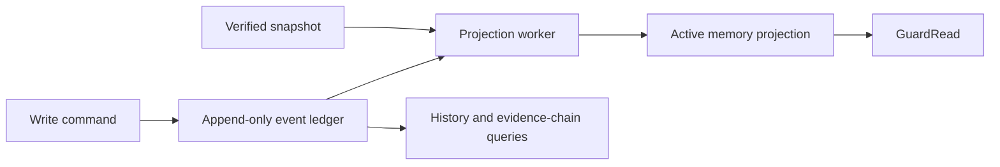

# Governance Pipeline Design

Status: **design draft for post-v0.8 iteration**

Audience: maintainers, enterprise AI engineers, security reviewers and integration authors

TARCS-Mem is a governance layer for enterprise LLM and Agent memory. It decides which claims may
become active memory, which evidence may be retrieved for a caller at a business time, and whether
an answer may be returned. The target pipeline is:

```text
Documents / conversations / approval records
                  |
            GuardWrite
 extract -> schema validate -> admission -> conflict resolver
                  |
  append-only audit events + active memory projection
                  |
User question -> hybrid retrieval -> RRF -> TARCS constraints/ranking
                  |                         |
                  |                    token-budget MMR
                  v                         v
              evidence pack -> verification -> answer / clarify / abstain
```

## Implementation status and non-goals

This document is deliberately more detailed than the current implementation. It is a target
design, not a claim that all described interfaces exist in v0.8.

| Area | v0.8 reference implementation | Target described here |
| --- | --- | --- |
| Write policy | Python `MemoryAdmission` and `ConflictResolver` | Versioned declarative policy bundles with typed extension points |
| Audit | Typed event enum and append-only inserts in SQLite | Rich event envelope, per-aggregate ordering, tamper evidence and pluggable immutable storage |
| Projection | Mutable `memories` table plus audit history | Rebuildable event-folded projection with checkpoints and snapshots |
| Retrieval | Lexical + hashed semantic retrieval, RRF, fixed `TARCSConfig` and MMR | Pluggable sources, fusion, constraint and verification components |
| Audit queries | Record audit trail and privacy-safe traces | Answer-centric evidence chains, cross-record search and policy-version lookup |

The design does not turn TARCS-Mem into a chatbot builder, identity provider, document parser or
general workflow engine. Authentication systems establish caller identity; extractors create
candidate claims; model providers generate text. TARCS-Mem owns the governance decisions between
those systems.

## Design invariants

1. A model cannot mark its own assertion as authoritative or approve its own write.
2. Tenant, identity and role constraints are enforced before inaccessible content enters a
   ranking or generation boundary.
3. Every state transition is explainable by immutable input references, a versioned policy and
   an auditable decision.
4. Business validity time and system observation time remain separate.
5. Projection loss must be recoverable from the event ledger plus an optional verified snapshot.
6. Missing identity, unavailable policy, invalid configuration or unverifiable citations fail
   closed.
7. Auditability does not justify storing secrets, raw questions or unnecessary personal data.

---

# Part I — GuardWrite, Audit Ledger and Active Memory Projection

## GuardWrite responsibility boundaries

| Stage | Owns | Must not own | Result |
| --- | --- | --- | --- |
| `extract` | Convert approved source content into candidate atomic claims and source spans | Authority, activation or conflict decisions | One or more `MemoryItemCandidate` objects |
| `schema_validate` | Structural types, required fields, bounded values, time interval validity and tenant/source consistency | Semantic authority or business approval | `SchemaValidationResult` |
| `admission` | Source trust, evidence completeness, durability, classification and review requirements | Mutation of prior versions | `PolicyDecision` with `accept`, `review` or `reject` |
| `conflict_resolver` | Compare overlapping claims within the same tenant and conflict domain; decide supersession or review | Destructive overwrite of history | `ConflictResolutionResult` and proposed transitions |

Extraction is untrusted input preparation. Schema validation proves that a candidate is well
formed, not that it is true. Admission decides whether the candidate is eligible for activation.
Conflict resolution decides how that eligible candidate interacts with existing states. Keeping
these responsibilities separate prevents a high-confidence extractor from becoming an implicit
policy engine.

## Core data contracts

The following Python-style models are illustrative. They should be published as versioned JSON
Schemas or OpenAPI components before implementation. They extend, rather than silently redefine,
the current `MemoryRecord` contract.

```python
from datetime import date, datetime
from typing import Any, Literal

Decision = Literal["accept", "review", "reject"]
MemoryState = Literal[
    "candidate", "pending", "verified_active", "superseded", "expired", "rejected"
]

class ActorRef(BaseModel):
    actor_type: Literal["user", "service", "agent", "system"]
    actor_id: str                    # stable opaque ID, not a display name
    authentication_context_id: str | None
    delegated_by: str | None = None

class SourceDescriptor(BaseModel):
    source_type: str
    source_uri: str | None
    source_ref: str                  # human-readable citation label
    content_hash: str                # hash of normalized source material
    connector_id: str | None
    observed_at: datetime
    license_or_terms: str | None

class EvidenceRef(BaseModel):
    evidence_id: str
    source_ref: str
    span_ref: str | None             # page, row, message or character range
    content_hash: str

class MemoryItemCandidate(BaseModel):
    memory_id: str
    tenant_id: str
    fact: str
    conflict_key: str
    source: SourceDescriptor
    evidence: list[EvidenceRef]
    valid_from: date | None
    valid_to: date | None
    extraction_confidence: float
    durable_value: float
    authority_hint: float | None     # untrusted until policy evaluates the source
    classification: str
    allowed_roles: list[str]
    metadata: dict[str, Any]

class WriteRequest(BaseModel):
    request_id: str
    idempotency_key: str
    actor: ActorRef
    submitted_at: datetime
    candidate: MemoryItemCandidate
    requested_policy_bundle: str | None
    trace_id: str | None

class ValidationIssue(BaseModel):
    code: str
    path: str
    message: str
    severity: Literal["error", "warning"]

class SchemaValidationResult(BaseModel):
    valid: bool
    schema_version: str
    normalized_candidate_hash: str | None
    issues: list[ValidationIssue]

class PolicyRef(BaseModel):
    bundle_id: str
    version: str
    digest: str
    evaluated_at: datetime

class PolicyDecision(BaseModel):
    decision_id: str
    outcome: Decision
    target_state: MemoryState
    reason_codes: list[str]
    obligations: list[str]           # e.g. require_human_review, redact_before_store
    effective_authority: float
    policy: PolicyRef
    input_hash: str

class StateTransition(BaseModel):
    memory_id: str
    from_state: MemoryState | None
    to_state: MemoryState
    valid_to: date | None = None

class ConflictResolutionResult(BaseModel):
    resolution_id: str
    outcome: Literal["no_conflict", "supersede", "review", "reject"]
    conflict_key: str
    compared_memory_ids: list[str]
    transitions: list[StateTransition]
    reason_codes: list[str]
    policy: PolicyRef

class WriteResult(BaseModel):
    request_id: str
    memory_id: str
    final_state: MemoryState
    validation: SchemaValidationResult
    admission: PolicyDecision | None
    conflict: ConflictResolutionResult | None
    last_event_id: str
    projection_version: int
```

`authority_hint` is never trusted directly. A policy derives `effective_authority` from source
type, connector trust, publication workflow and verified actor claims. Likewise, a request-body
role is not a verified identity claim.

## Configurable policy engine

The engine loads a signed, versioned `PolicyBundle`. Structural invariants remain in code: valid
dates, non-empty tenant IDs, bounded confidence values and recognized classifications cannot be
disabled by configuration. Business rules are declarative. Carefully reviewed Python plugins may
implement predicates that cannot be expressed declaratively, but policy files must never execute
arbitrary Python or templates from an untrusted tenant.

Evaluation uses a deterministic combination rule:

1. validate the policy bundle and its digest;
2. normalize inputs and compute an input hash;
3. evaluate mandatory deny rules;
4. evaluate review obligations;
5. evaluate allow/activation rules;
6. return the most restrictive result: `reject > review > accept`;
7. persist the full policy reference, reason codes and safe input summary in the audit event.

Example YAML — illustrative, not accepted by v0.8:

```yaml
apiVersion: tarcsmem.io/v1alpha1
kind: MemoryGovernancePolicy
metadata:
  name: enterprise-policy-memory
  version: 2026-08-01
spec:
  schema:
    required: [tenant_id, fact, conflict_key, source.source_ref, classification]
    classifications: [public, internal, confidential, restricted]
    require_valid_from_for: [official_policy, approved_exception]

  admission:
    default: review
    rules:
      - id: reject-model-inference-as-fact
        when: source.source_type == "model_inference"
        outcome: reject
        reason: MODEL_INFERENCE_NOT_AUTHORITATIVE
      - id: require-traceable-evidence
        when: size(evidence) == 0
        outcome: review
        reason: EVIDENCE_REQUIRED
      - id: activate-published-policy
        when: >-
          source.source_type == "official_policy" &&
          extraction_confidence >= 0.75 && durable_value >= 0.70
        outcome: accept
        state: verified_active
        authority: 1.0

  conflicts:
    scope: [tenant_id, conflict_key]
    overlap: valid_time
    autoSupersedeWhen: >-
      incoming.state == "verified_active" &&
      incoming.effective_authority > existing.effective_authority &&
      incoming.valid_from != null
    ambiguousOutcome: review
```

Configuration validation should reject unknown predicates, circular imports, duplicate rule IDs,
invalid state transitions and a rule set with no safe default. A dry-run API should compare a new
bundle with the active version against recorded, redacted fixtures before activation.

## Audit event schema

All domain events share an envelope. Event-specific payloads are schema-versioned independently.

```python
class AuditEventEnvelope(BaseModel):
    event_id: str
    event_type: str
    event_schema_version: str
    occurred_at: datetime
    recorded_at: datetime

    tenant_id: str
    aggregate_type: Literal["memory", "answer", "policy", "projection"]
    aggregate_id: str
    aggregate_sequence: int
    ledger_partition: str
    ledger_position: str            # monotonic cursor within the partition

    actor: ActorRef
    correlation_id: str             # one write/query/answer workflow
    causation_id: str | None         # event or command that caused this event
    request_id: str | None
    trace_id: str | None

    policy: PolicyRef | None
    subject_memory_ids: list[str]
    payload: dict[str, Any]
    payload_classification: str
    redaction_summary: dict[str, int]

    previous_event_hash: str | None
    event_hash: str                  # hash of canonical envelope excluding this field/signature
    signature: str | None
    signing_key_id: str | None
```

### Event catalogue

| Event type | Required payload fields | Purpose |
| --- | --- | --- |
| `input_ingested` | `source_ref_hash`, `content_hash`, `connector_id`, `idempotency_key_hash` | Record receipt without copying raw source text into the ledger |
| `schema_validation_failed` | `schema_version`, `issues`, `candidate_hash` | Explain why a malformed input was rejected |
| `schema_validation_succeeded` | `schema_version`, `candidate_hash`, `normalizations` | Pin the normalized input evaluated by policy |
| `admission_accepted` | `decision_id`, `target_state`, `reason_codes`, `obligations` | Record an automatic activation/accept decision |
| `admission_review_required` | same as above plus `review_queue` | Explain why human approval is required |
| `admission_rejected` | `decision_id`, `reason_codes` | Record a policy rejection |
| `conflict_detected` | `conflict_key_hash`, `compared_memory_ids`, `overlap` | Identify the compared version set |
| `conflict_resolved` | `resolution_id`, `outcome`, `transitions`, `reason_codes` | Explain supersession or escalation |
| `human_approval_recorded` | `review_id`, `decision`, `reviewer_id`, `note_hash`, `ticket_ref` | Record a named human decision; notes belong in classified storage |
| `memory_state_changed` | `from_state`, `to_state`, `valid_from`, `valid_to` | Drive the active-memory projection |
| `memory_accessed` | `purpose`, `access_decision`, `policy_reason_codes`, `query_hash` | Prove permitted/denied access without storing a raw query |
| `evidence_pack_created` | `evidence_pack_id`, `answer_id`, `selected`, `excluded_summary`, `pack_hash` | Bind retrieval results to the answer workflow |
| `answer_generated` | `answer_id`, `provider`, `model`, `answer_hash`, `evidence_pack_id` | Record generation without requiring answer text in the ledger |
| `answer_abstained` | `answer_id`, `reason_codes`, `evidence_pack_id` | Explain fail-closed outcomes |
| `answer_clarification_requested` | `answer_id`, `missing_context_codes` | Explain why the system asks for identity, date or scope |
| `answer_verified` | `answer_id`, `verification_results`, `citation_refs` | Record citation and policy verification |
| `policy_bundle_activated` | `bundle_id`, `version`, `digest`, `approved_by` | Make policy changes auditable |
| `projection_checkpointed` | `projection`, `last_event_id`, `last_sequence`, `snapshot_hash` | Bind a snapshot to the ledger position |

The class-style names in external documentation may be `InputIngestedEvent` or
`HumanApprovalEvent`; the stable wire values should be lower snake case. Event names describe
facts that happened, not commands that might fail.

## Append-only ledger contract

An `AuditLedger` adapter should expose only append and read operations:

```python
class AuditLedger(Protocol):
    def append(self, event: AuditEventEnvelope, expected_sequence: int) -> AppendReceipt: ...
    def read_stream(self, tenant_id: str, aggregate_id: str, after_sequence: int = 0) -> list[AuditEventEnvelope]: ...
    def scan(self, tenant_id: str, cursor: str | None, filters: AuditFilters) -> AuditPage: ...
    def verify_chain(self, tenant_id: str, aggregate_id: str) -> ChainVerificationResult: ...
```

Required properties:

- no update or in-place delete API for domain events;
- unique `event_id` and monotonically increasing sequence per aggregate;
- optimistic concurrency through `expected_sequence`;
- idempotent append using command/request identity;
- canonical serialization before hashing;
- a hash chain per aggregate or sealed partition, with optional KMS/HSM signatures;
- encrypted storage, access logs, retention policy, legal-hold handling and verified export;
- regular chain verification and independent checkpoint anchoring.

A hash chain detects modification; it does not provide confidentiality, authorization or backup.
Sensitive payloads should live in access-controlled encrypted storage and be referenced by hash.
Where erasure is legally required, append a redaction/tombstone event and cryptographically erase
the separately stored payload key instead of rewriting historical decision metadata.

The SQLite store remains a development reference. It performs insert-only audit writes but does
not yet provide sequence concurrency, chain hashes, signatures, WORM retention or event-sourced
projection recovery.

## Active memory projection

The projection is a disposable, query-optimized view derived by folding ordered domain events.
It is not the source of audit truth.



An `ActiveMemoryRow` contains the current state, effective validity interval, policy decision,
classification, ACL material required for pre-filtering, source/evidence references and the
`last_applied_event_sequence`. It may duplicate data for query performance, but every field must
be attributable to an event.

Projection update algorithm:

```python
def apply(row: ActiveMemoryRow | None, event: AuditEventEnvelope) -> ActiveMemoryRow | None:
    assert event.aggregate_sequence == (row.last_sequence + 1 if row else 1)
    match event.event_type:
        case "admission_accepted" | "admission_review_required":
            return create_or_update_candidate(row, event)
        case "memory_state_changed":
            return apply_state_and_validity(row, event)
        case "human_approval_recorded":
            return attach_review_reference(row, event)
        case _:
            return row
```

Rebuild modes:

1. **Full replay:** create an empty projection and fold all events in tenant/aggregate order.
2. **Snapshot plus delta:** load a snapshot whose hash and ledger position have been verified,
   then replay later events.
3. **Online incremental update:** consume committed events, apply each event transactionally and
   advance a checkpoint. Duplicate events are ignored by `(projection_name, event_id)`.

Projection lag must be visible. A read response should include `projection_as_of_event_id` and,
where strict read-after-write is required, wait for a requested event position or return a clear
`projection_not_caught_up` result.

Proposed APIs:

```python
get_current_memory_for_user(
    principal: VerifiedPrincipal,
    as_of: date,
    filters: MemoryFilters,
    page: PageRequest,
) -> MemoryProjectionPage

get_memory_history(
    principal: VerifiedPrincipal,
    memory_id: str,
    include_payloads: bool = False,
) -> MemoryHistory

get_audit_trail_for_answer(
    principal: VerifiedPrincipal,
    answer_id: str,
) -> AnswerEvidenceChain

rebuild_projection(
    projection_name: str,
    tenant_id: str,
    from_snapshot_id: str | None,
    dry_run: bool = True,
) -> ProjectionRebuildReport
```

---

# Part II — Configurable Retrieval, Ranking and Constraint Pipeline

## Component contracts

Retrieval is an ordered composition of typed plugins. Plugins receive verified identity claims
and must return normalized candidates, not final answers.

```python
class RetrievalRequest(BaseModel):
    query_id: str
    question: str
    question_hash: str
    as_of: date
    principal: VerifiedPrincipal
    route: str
    top_k_per_source: int

class RetrievalCandidate(BaseModel):
    memory_id: str
    source_id: str
    source_rank: int
    raw_score: float | None
    content_hash: str
    classification: str
    valid_from: date | None
    valid_to: date | None
    feature_refs: dict[str, float]

class RetrieverPlugin(Protocol):
    def search(self, request: RetrievalRequest, config: dict) -> list[RetrievalCandidate]: ...

class FusionPlugin(Protocol):
    def fuse(self, result_sets: list[list[RetrievalCandidate]], config: dict) -> list[FusedCandidate]: ...

class ConstraintPlugin(Protocol):
    def evaluate(self, candidate: FusedCandidate, context: GovernanceContext) -> ConstraintDecision: ...

class RankerPlugin(Protocol):
    def rank(self, candidates: list[GovernedCandidate], context: GovernanceContext) -> list[RankedEvidence]: ...
```

Supported source categories may include vector, BM25/keyword, graph and structured-database
retrievers. A source configuration declares its adapter, weight, candidate limit, timeout,
required identity claims and source-specific filters. For remote stores, tenant/ACL constraints
must be pushed into the source query where supported. TARCS-Mem still rechecks normalized
candidates; post-retrieval filtering alone is not an acceptable confidentiality boundary.

Fusion is replaceable (`rrf`, weighted RRF, calibrated score fusion or a future learned fusion)
and never overrides hard constraints. TARCS runs in two stages:

1. hard constraints remove tenant/ACL, state, validity, classification and conflict-ineligible
   evidence;
2. soft ranking combines relevance, validity, authority, reliability and cost, with all component
   scores included in the decision trace.

Recommended execution order:

```text
verified principal -> route -> source-level ACL filters -> parallel retrieval
-> normalize/deduplicate -> fusion -> hard governance constraints
-> relevance floor -> TARCS ranking -> token-budget MMR
-> evidence pack -> verification -> answer | clarify | abstain
```

## Pipeline configuration envelope

```yaml
apiVersion: tarcsmem.io/v1alpha1
kind: RetrievalPipeline
metadata:
  name: example
  version: 2026-08-01
spec:
  failureMode: fail_closed
  totalTimeoutMs: 2500
  sources: []
  fusion: {}
  constraints: []
  ranking: {}
  selection: {}
  verification: []
```

Configuration is schema-validated, versioned, hashed and referenced in every evidence pack. A
request may select only an administrator-approved bundle; clients cannot submit arbitrary weights
or disable constraints. Organization-specific overlays may tighten the mandatory baseline but may
not weaken tenant isolation, verified-identity, classification or audit requirements. Required
source failure stops the pipeline; optional-source failure is surfaced in the evidence pack and
audit trail instead of being silently ignored.

## Financial research example

This example prioritizes timely SEC filings and organization-licensed research. It does not imply
that redistribution of licensed reports is permitted.

```yaml
apiVersion: tarcsmem.io/v1alpha1
kind: RetrievalPipeline
metadata: {name: financial-research, version: 2026-08-01}
spec:
  failureMode: fail_closed
  sources:
    - id: sec-vector
      adapter: qdrant
      weight: 1.00
      topK: 40
      filters: {source_type: [sec_filing], tenant_from_claim: true}
    - id: sec-keyword
      adapter: bm25
      weight: 0.90
      topK: 40
      filters: {source_type: [sec_filing], tenant_from_claim: true}
    - id: licensed-research
      adapter: enterprise_search
      weight: 0.75
      topK: 20
      requiredClaims: [research_entitlement]
      filters: {license_scope_from_claim: true, tenant_from_claim: true}
    - id: market-data
      adapter: structured_sql
      weight: 0.70
      topK: 20
      queryTemplateId: approved-market-facts-v2

  fusion: {adapter: weighted_rrf, k: 60, deduplicateBy: content_hash}
  constraints:
    - {adapter: tenant_acl, mode: hard}
    - {adapter: business_valid_time, mode: hard}
    - {adapter: source_license, mode: hard}
    - {adapter: filing_period_match, mode: hard}
    - {adapter: freshness, maxAgeDays: 120, allowHistoricalWhenAsOf: true}
  ranking:
    adapter: tarcs
    weights: {relevance: 0.40, validity: 0.20, authority: 0.20, reliability: 0.15, cost: 0.05}
    minRelevance: 0.22
  selection: {adapter: constrained_mmr, tokenBudget: 3000, diversityLambda: 0.18, onePerConflictKey: true}
  verification:
    - {adapter: citation_membership, required: true}
    - {adapter: source_license, required: true}
    - {adapter: numerical_claim_support, required: true}
```

## Enterprise knowledge-base example

```yaml
apiVersion: tarcsmem.io/v1alpha1
kind: RetrievalPipeline
metadata: {name: enterprise-knowledge, version: 2026-08-01}
spec:
  failureMode: fail_closed
  sources:
    - id: confluence-vector
      adapter: qdrant
      weight: 0.95
      topK: 50
      filters: {connector: confluence, tenant_from_claim: true, acl_from_claim: true}
    - id: confluence-keyword
      adapter: bm25
      weight: 1.00
      topK: 50
      filters: {connector: confluence, tenant_from_claim: true, acl_from_claim: true}
    - id: policy-db
      adapter: structured_sql
      weight: 1.10
      topK: 20
      queryTemplateId: active-policy-by-business-date-v1

  fusion: {adapter: weighted_rrf, k: 60, deduplicateBy: memory_id}
  constraints:
    - {adapter: verified_identity, mode: hard}
    - {adapter: tenant_acl, mode: hard}
    - {adapter: classification, allowed_from_claim: true, mode: hard}
    - {adapter: active_or_historical_state, mode: hard}
    - {adapter: business_valid_time, mode: hard}
    - {adapter: unresolved_conflict, mode: hard}
  ranking:
    adapter: tarcs
    weights: {relevance: 0.42, validity: 0.18, authority: 0.20, reliability: 0.15, cost: 0.05}
    minRelevance: 0.20
  selection: {adapter: constrained_mmr, tokenBudget: 2400, diversityLambda: 0.20, onePerConflictKey: true}
  verification:
    - {adapter: citation_membership, required: true}
    - {adapter: classification_egress, required: true}
    - {adapter: evidence_freshness, required: true}
```

## Token-budget MMR interface

```python
class SelectionConfig(BaseModel):
    max_context_tokens: int
    diversity_lambda: float
    max_items: int | None
    one_per_conflict_key: bool = True

class EvidenceSelector(Protocol):
    def select(
        self,
        query: str,
        ranked: list[RankedEvidence],
        tokenizer: TokenEstimator,
        config: SelectionConfig,
    ) -> SelectionResult: ...

class SelectionResult(BaseModel):
    selected: list[SelectedEvidence]
    excluded: list[ExclusionDecision]
    tokens_used: int
    budget: int
    algorithm: str
    algorithm_version: str
```

Pseudocode:

```python
selected, spent = [], 0
while candidates:
    feasible = [c for c in candidates if spent + tokens(c) <= budget]
    feasible = remove_duplicate_conflict_keys(feasible, selected)
    if not feasible:
        break
    best = argmax(
        (1 - lambda_) * c.tarcs_score
        - lambda_ * max_similarity(c.content, selected)
        for c in feasible
    )
    if best.mmr_score <= 0:
        break
    selected.append(best)
    spent += tokens(best)
    candidates.remove(best)
```

## Evidence pack contract

```python
class EvidencePack(BaseModel):
    evidence_pack_id: str
    answer_id: str
    tenant_id: str
    query_hash: str
    as_of: date
    principal_snapshot_hash: str
    retrieval_pipeline: PolicyRef
    governance_policy: PolicyRef
    projection_checkpoint: str
    created_at: datetime
    selected: list[SelectedEvidence]
    excluded_summary: dict[str, int]
    token_budget: int
    tokens_used: int
    pack_hash: str
    creation_event_id: str

class SelectedEvidence(BaseModel):
    memory_id: str
    source_ref: str
    content_ref: str                 # access-controlled materialization reference
    source_content_hash: str
    projection_version: int
    classification: str
    valid_from: date | None
    valid_to: date | None
    scores: dict[str, float]
    reason_codes: list[str]
    write_event_id: str
    latest_state_event_id: str
```

The model receives only the minimum content required from `selected`, while the durable pack can
store hashes and references. `evidence_pack_created` binds the pack hash to the answer ID and audit
correlation ID.

Verification policies may include:

- evidence-pack membership for every citation;
- source classification and cloud-egress permission;
- business-time validity and projection version consistency;
- minimum relevance and permitted source classes;
- unsupported or conflicting atomic claim detection;
- numerical/table claim support for financial workflows;
- answer hash and model/provider metadata capture.

Use `clarify` when required query context is missing but the user can supply it, such as business
date, legal entity or authenticated scope. Use `abstain` when governed evidence is absent,
conflicting, unauthorized, stale or fails verification.

---

# Part III — Audit Queries and Evidence-Chain View

## Query API design

Audit APIs require an independently verified principal and purpose. They must apply tenant and
role constraints to both metadata and referenced payloads.

```python
get_answer_audit_trail(
    principal: VerifiedPrincipal,
    answer_id: str,
    include_evidence_content: bool = False,
) -> AnswerEvidenceChain

get_user_memory_audit_trail(
    principal: VerifiedPrincipal,
    subject_user_id: str,
    time_range: TimeRange,
    purpose: str,
    cursor: str | None = None,
) -> AuditPage

search_audit_events(
    principal: VerifiedPrincipal,
    filters: AuditFilters,           # type, actor, policy version, memory, answer, outcome
    time_range: TimeRange,
    cursor: str | None = None,
) -> AuditPage

verify_audit_chain(
    principal: VerifiedPrincipal,
    aggregate_type: str,
    aggregate_id: str,
) -> ChainVerificationResult

compare_policy_decisions(
    principal: VerifiedPrincipal,
    policy_a: PolicyRef,
    policy_b: PolicyRef,
    fixture_set_id: str,
) -> PolicyDiffReport
```

Avoid unrestricted full-text audit search. Common filters should use opaque identifiers, event
types, time ranges and reason codes. Every sensitive audit read can itself emit a privacy-safe
`audit_data_accessed` event.

## Evidence-chain view

The evidence-chain view joins three immutable/reference domains without pretending they are one
record:

1. **Answer decision:** question hash, caller snapshot hash, route, outcome and verification.
2. **Evidence selection:** pack version, selected/excluded decisions, scores and retrieval policy.
3. **Memory lineage:** original source reference, admission/conflict policies, state transitions
   and named approvals for each selected memory.

```json
{
  "answer_id": "ans_01J...",
  "outcome": "answered",
  "occurred_at": "2026-08-06T10:30:00Z",
  "question_hash": "sha256:...",
  "principal_snapshot_hash": "sha256:...",
  "correlation_id": "corr_01J...",
  "policies": {
    "retrieval": {"id": "enterprise-knowledge", "version": "2026-08-01", "digest": "sha256:..."},
    "governance": {"id": "enterprise-policy-memory", "version": "2026-08-01", "digest": "sha256:..."}
  },
  "evidence_pack": {
    "id": "pack_01J...",
    "hash": "sha256:...",
    "projection_checkpoint": "evt_0001842",
    "tokens_used": 841,
    "token_budget": 2400,
    "excluded_summary": {"acl_denied": 4, "expired": 2, "low_relevance": 7}
  },
  "evidence": [
    {
      "memory_id": "mem_01J...",
      "source_ref": "POLICY-SALES-2026-07#1",
      "selected_because": ["ACTIVE_AT_AS_OF", "ROLE_ALLOWED", "HIGH_AUTHORITY"],
      "scores": {"rrf": 0.91, "tarcs": 0.88, "mmr": 0.72},
      "write_lineage": {
        "ingested_event_id": "evt_0001210",
        "admission_event_id": "evt_0001212",
        "policy_version": "2026-08-01",
        "state_transitions": [
          {"event_id": "evt_0001213", "from": "candidate", "to": "verified_active"}
        ],
        "approvals": []
      }
    }
  ],
  "verification": {
    "status": "passed",
    "citation_membership": "passed",
    "business_time": "passed",
    "classification_egress": "passed"
  },
  "integrity": {
    "chain_verified": true,
    "verified_through_event_id": "evt_0001850"
  }
}
```

The console should render this as progressive disclosure: outcome and policy first, evidence
cards second, and raw event lineage last. A compliance user should be able to answer “what was
used, why was it allowed, under which policy, and who approved it?” without reading raw JSON.

---

# Part IV — Copyable Architecture Documentation Structure

The following outline can be used for a future architecture chapter or split into focused design
documents as the implementation lands.

## 1. Introduction

> TARCS-Mem is a provider-neutral governance layer for enterprise RAG and AI Agent memory. It
> controls what may become durable memory, what a verified caller may retrieve at a business time,
> and whether generated output is sufficiently grounded to return. It complements identity,
> storage and model systems rather than replacing them.

## 2. Architecture overview

> The write path transforms untrusted source material into governed memory through extraction,
> structural validation, admission policy and conflict resolution. Decisions are appended to an
> audit ledger, while a rebuildable projection serves current reads. The read path retrieves from
> approved sources, applies identity and time constraints, fuses and ranks eligible candidates,
> selects a diverse evidence pack under a token budget, and verifies the final answer.

Suggested subsections:

- System context and trust boundaries
- Write, projection and read data flow
- Current v0.8 behavior versus target design
- Failure modes and fail-closed invariants

## 3. GuardWrite and audit layer

> GuardWrite separates extraction quality from governance authority. Schema validation establishes
> that a candidate is well formed; admission determines whether it may be activated; conflict
> resolution determines whether existing active memory is superseded or human review is required.
> Every transition references immutable inputs and a versioned policy decision.

Suggested subsections:

- Stage responsibilities and typed contracts
- Versioned policy bundles and deterministic evaluation
- Event catalogue and append-only storage contract
- Human approval and conflict escalation
- Active projection, replay and snapshot recovery

## 4. Retrieval and ranking layer

> GuardRead accepts only verified caller attributes. Source adapters apply tenant and ACL filters,
> normalized result sets are fused, and hard governance constraints execute before TARCS ranking.
> Token-budget MMR then selects a compact, diverse evidence set without admitting a second version
> of the same conflict domain.

Suggested subsections:

- Retriever, fusion, constraint and ranker plugin contracts
- RRF and score normalization
- TARCS hard constraints and soft-ranking features
- Relevance floor and token-budget MMR
- Scenario-specific pipeline configuration

## 5. Answer and governance strategies

> An evidence pack is a versioned contract between retrieval and generation. It binds selected
> memory versions, policy digests, projection position and selection reasons to an answer ID.
> Verification ensures citations belong to that pack and that source, time, classification and
> egress policies still permit the answer. The result is answer, clarify or abstain.

Suggested subsections:

- Evidence pack schema
- Citation and atomic-claim verification
- Cloud-egress and classification policy
- Answer, clarify and abstain semantics
- Evidence-chain UI and audit queries

## 6. Extensibility and configuration

> Extensions implement narrow typed contracts and cannot bypass server-owned governance. Policy
> and retrieval bundles are validated, versioned, hashed and activated by an authorized operator.
> Configuration changes are dry-run against redacted fixtures and remain attributable in audit
> results.

Suggested subsections:

- Policy and retrieval configuration lifecycle
- Connector and plugin security requirements
- Schema compatibility and migration rules
- Dry-run, replay and evaluation tooling
- Community extension points versus enterprise integrations

## Implementation sequence

The design should be implemented incrementally:

1. Version and enrich the event envelope while keeping the current SQLite adapter.
2. Add stable `answer_id`, `evidence_pack_id`, correlation IDs and answer-centric audit queries.
3. Define projection fold tests and prove full replay produces the same current state.
4. Introduce validated policy/retrieval bundle models in dry-run mode.
5. Extract retriever/fusion/constraint interfaces without changing v0.8 default behavior.
6. Add hash chaining and a production ledger adapter only after the event contract stabilizes.

Each step must preserve current security tests and add adversarial coverage for tenant leakage,
policy rollback, event reordering, duplicate delivery, stale projection reads, citation forgery and
configuration that attempts to disable mandatory constraints.
